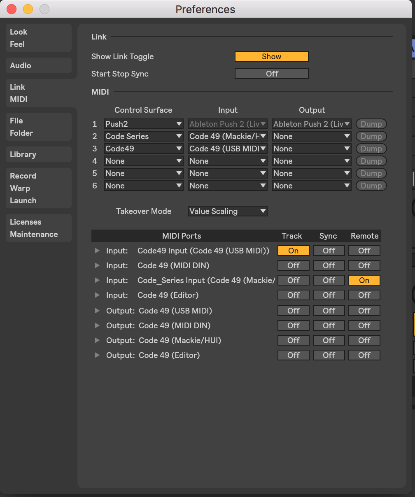

# code45-ableton-config
UserConfiguration.txt for Code45 that maps encoders to the macro bank currently showing the blue hand as well as working transport controls and volume sliders.

# Installation

Copy the `UserConfiguration.txt` file into a *new* directory in your Ableton Preferences folder. On MacOS, the folder is in `~/Library/Preferences/Ableton/Live 10.0.1/User Remote Scripts`. The folder name is used as the name in Ableton's midi configuration selection drop down.

For example, I have the file stored at:

```shell
/Users/roy/Library/Preferences/Ableton/Live 10.0.1/User Remote Scripts/Code49/UserConfiguration.txt
```

And I have my Ableton midi settings like this:


